# Azure Secure Web App Architecture

This project demonstrates a secure Azure web application architecture using:

- Azure Application Gateway (WAF v2)
- Azure Bastion
- Private backend virtual machines (no public IPs)
- Virtual Network with multiple subnets
- NSG rules to control traffic
- NGINX running on two Ubuntu web servers

## Project Goal

The purpose of this lab was to understand how production-style Azure environments handle security and traffic flow.

### Architecture Flow
Internet → Application Gateway (WAF) → Private backend VMs

### Administrative Access
Admin → Azure Bastion → Private backend VMs

---

## Architecture Diagram

---

## Screenshots

### 1. Resource Group
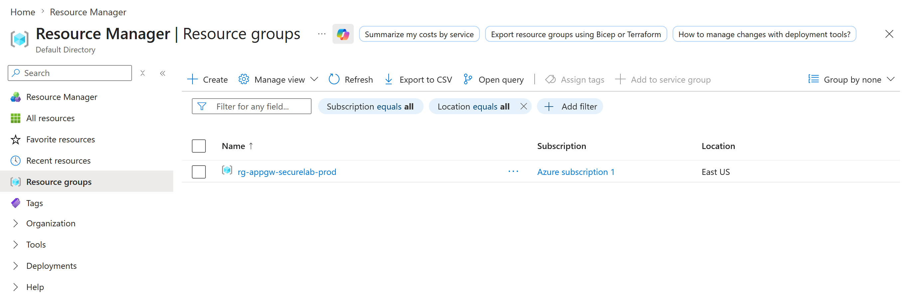

### 2. Virtual Network and Subnets
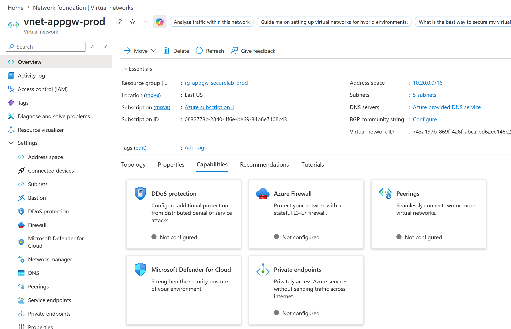

### 3. NSG Overview
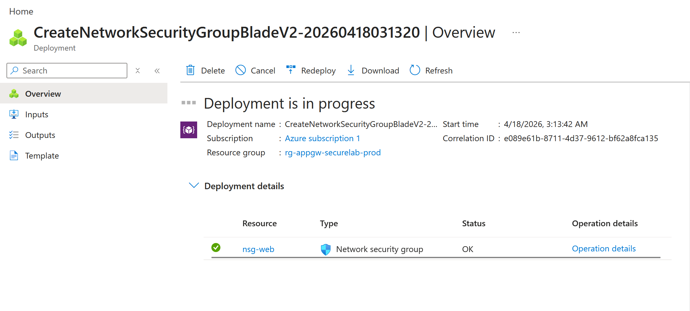

### 4. NSG Subnet Association
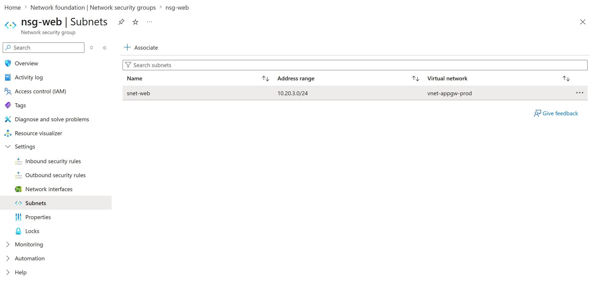

### 5. NSG Rules
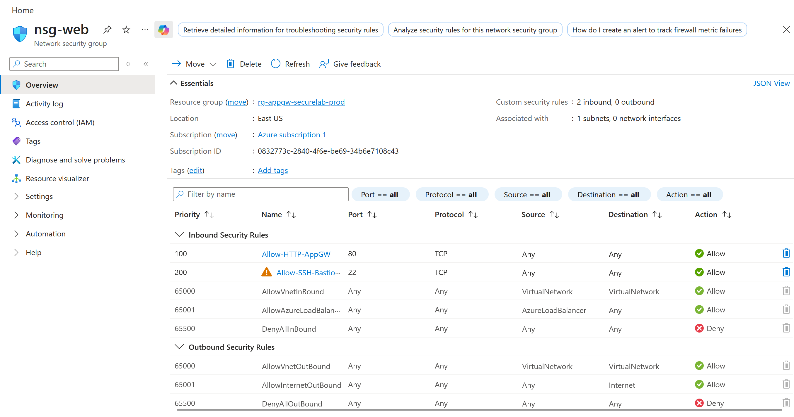

### 6. VM Web 01 Overview
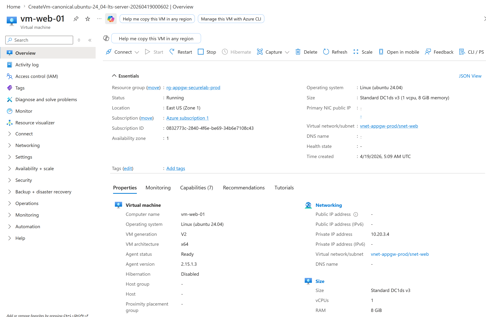

### 7. VM Web 02 Overview
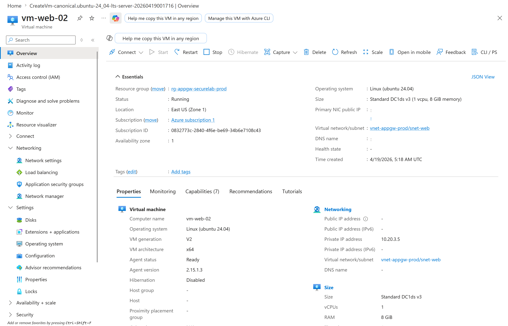

### 8. Bastion Overview
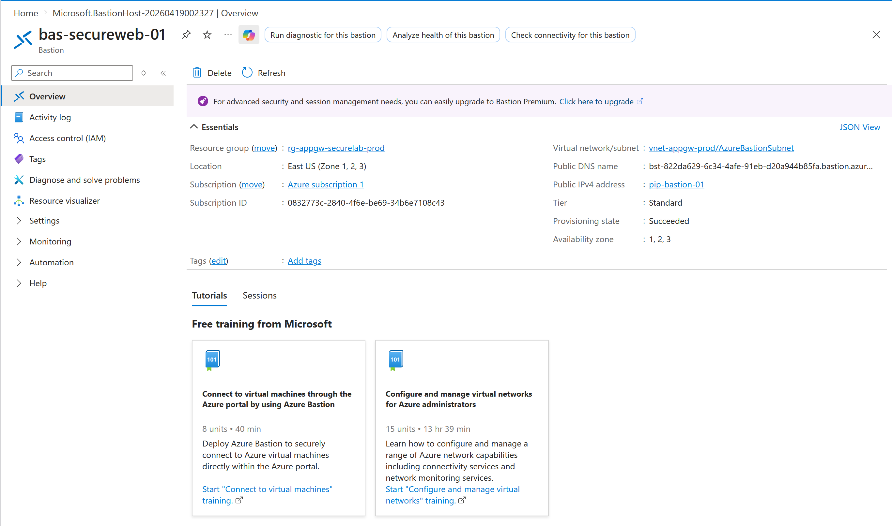

### 9. NGINX on VM Web 01
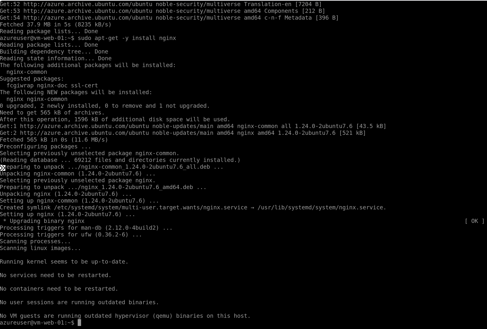

### 10. NGINX on VM Web 02
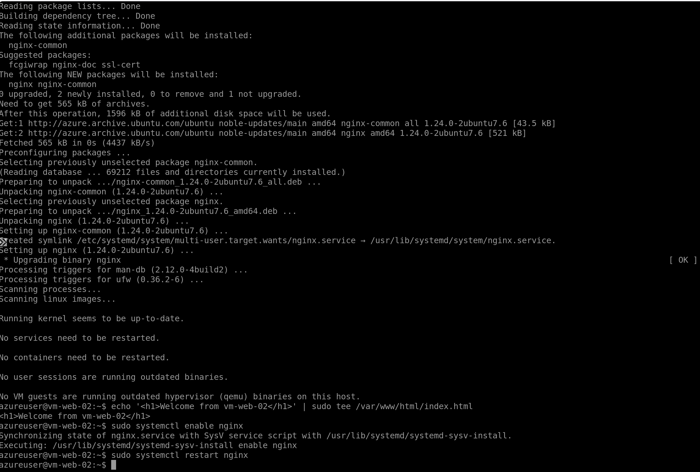

### 11. Application Gateway Public IP
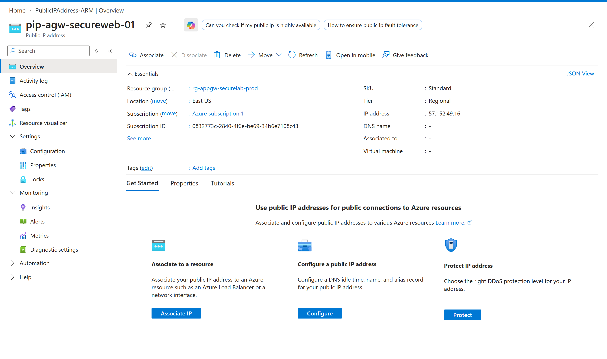

### 12. Application Gateway Overview
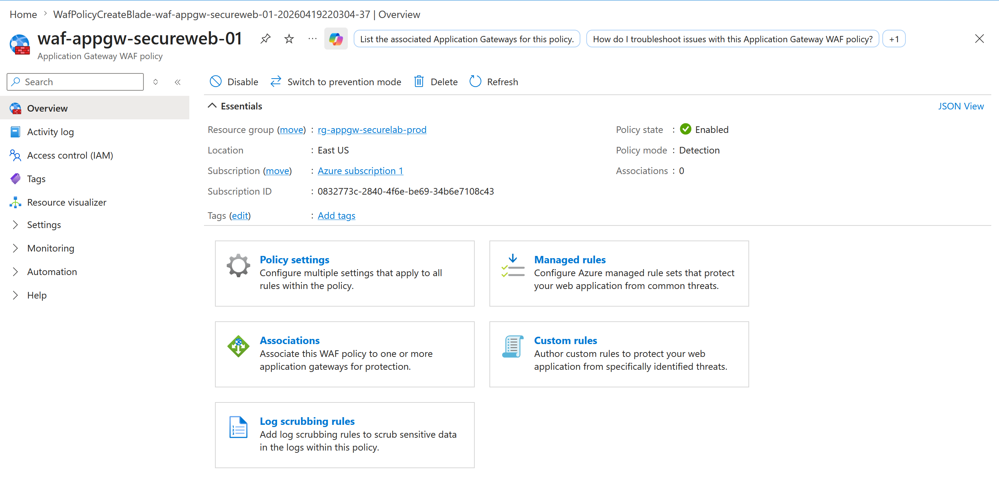

### 13. Backend Health
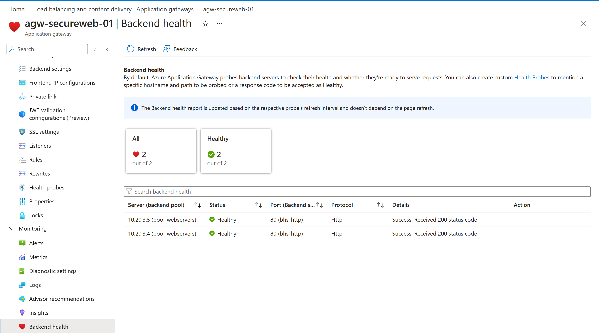

### 14. Custom Probe

### 15. Browser Test
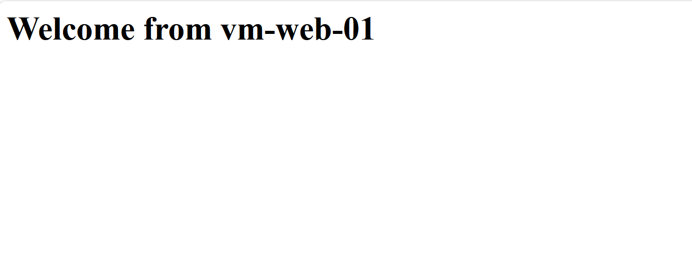
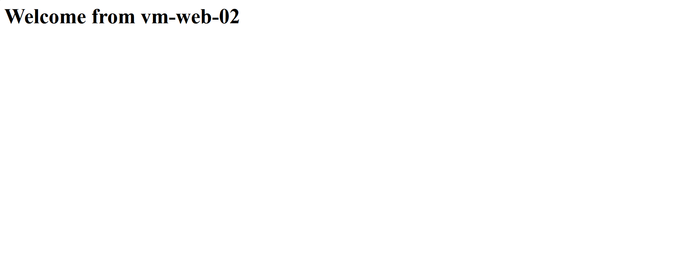

### 16. Final Resource Group View
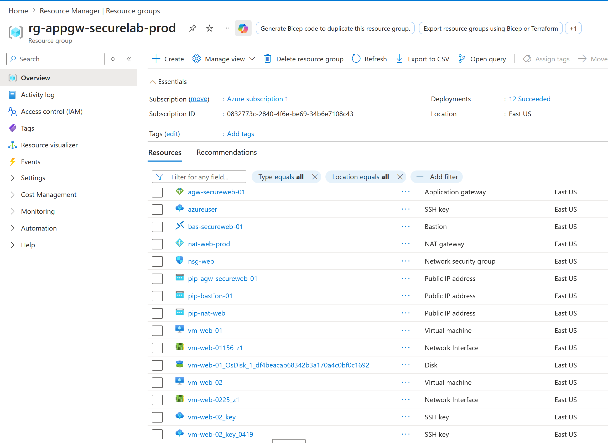
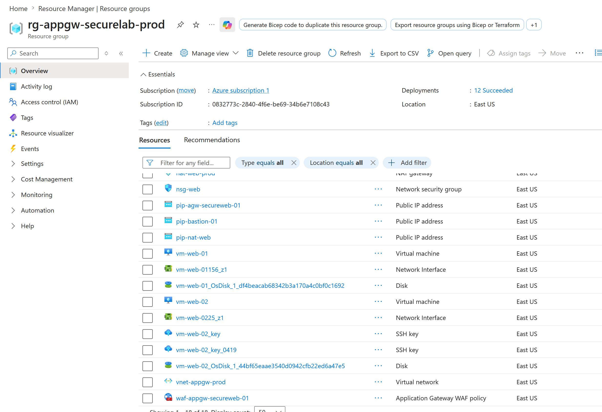

---

## Key Takeaways

- Application Gateway works at Layer 7
- WAF protects against common web-based threats
- Bastion provides secure remote access without public IP exposure
- Private backend VMs improve security posture
- NSGs and health probes are essential for proper traffic flow

---

## Documentation

- [Project Overview](docs/project-overview.md)
- [Deployment Steps](docs/deployment-steps.md)
- [Lessons Learned](docs/lessons-learned.md)
